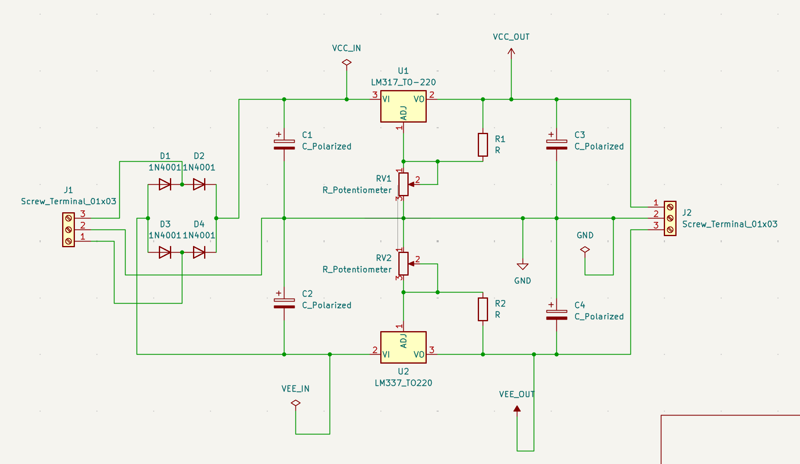
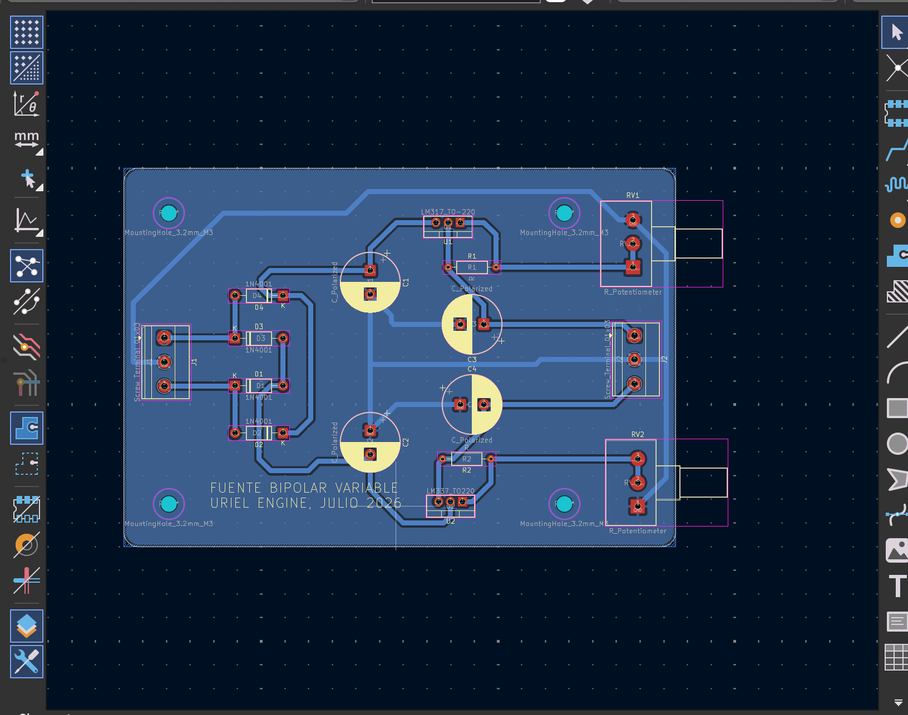
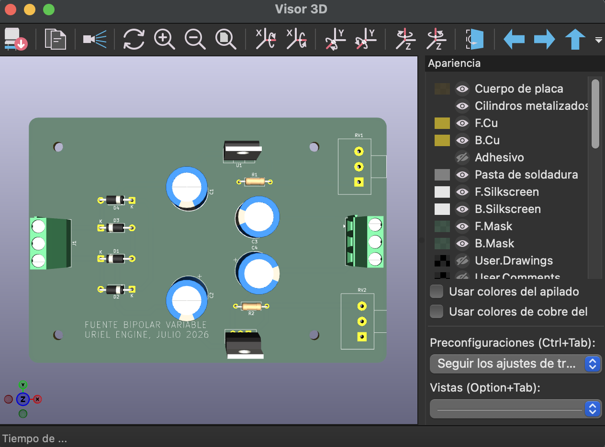
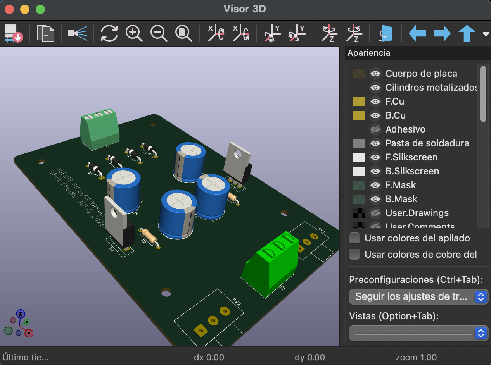

# Variable Bipolar Laboratory Power Supply


A variable bipolar linear power supply designed as a practical **analog electronics, PCB design, manufacturing, assembly, and hardware validation project**.

The board provides independently adjustable positive and negative voltage rails using the **LM317** and **LM337** linear voltage regulators. The complete circuit and PCB were designed in **KiCad**, professionally manufactured by **JLCPCB**, manually assembled, and functionally tested.

The main goal of this project was not to develop a novel power-supply topology, but to take a familiar analog circuit through a complete hardware development workflow:

**Requirements → Schematic → PCB Layout → 3D Verification → Manufacturing → Assembly → Bring-Up → Validation**

---

## Project Motivation

During my electronics studies, many analog laboratory exercises required a bipolar power supply, particularly circuits based on operational amplifiers that operate from positive and negative voltage rails.

While microcontroller projects can often be powered directly from 3.3 V or 5 V supplies, analog circuits frequently require both positive and negative supply rails.

I wanted a dedicated bipolar supply that I could use to recreate analog electronics laboratory experiments and eventually document them as educational engineering content.

I had previously fabricated PCBs using traditional DIY methods, but I wanted to take a design through an external professional PCB manufacturing process.

For that reason, I deliberately selected a regulator topology I was already familiar with and focused the project on the complete hardware-development workflow rather than on designing a new power-conversion architecture.

---

## System Architecture

The power supply is based on two adjustable linear regulators:

- **LM317** — adjustable positive voltage regulator
- **LM337** — adjustable negative voltage regulator

Together, they generate independently adjustable positive and negative rails referenced to a common ground.

The general architecture is:

```text
              ┌─────────┐
Positive ────►│  LM317  │────► +VOUT
Input         │         │
              └────┬────┘
                   │
              Adjustment
                   │
                  GND

                  GND
                   │
              Adjustment
                   │
              ┌────┴────┐
Negative ────►│  LM337  │────► -VOUT
Input         │         │
              └─────────┘
```

The PCB also incorporates input rectification, filtering capacitors, adjustment networks, and screw terminals for external connections.

---

## Schematic Design



The complete schematic was created in **KiCad**.

The input stage uses four **1N4001 rectifier diodes**. The positive regulation stage is built around the **LM317**, while the negative rail uses its complementary adjustable regulator, the **LM337**.

Each regulator uses a resistor and potentiometer network connected to its adjustment pin, allowing the corresponding output voltage to be varied.

Electrolytic capacitors are included on the positive and negative rails for filtering and stabilization.

The output connector provides three connections:

```text
+VOUT
 GND
-VOUT
```

This configuration makes the board suitable for bipolar-powered analog circuits such as operational-amplifier experiments.

---

## Main Components

| Component | Function |
|---|---|
| **LM317** | Adjustable positive linear voltage regulator |
| **LM337** | Adjustable negative linear voltage regulator |
| **1N4001 ×4** | Input rectification |
| **RV1** | Positive output voltage adjustment |
| **RV2** | Negative output voltage adjustment |
| **R1 / R2** | Regulator adjustment network |
| **C1 / C2** | Input filtering |
| **C3 / C4** | Output filtering |
| **J1** | Power input |
| **J2** | Bipolar output (+V / GND / -V) |

The design intentionally uses mostly **through-hole components**. This made the first revision easy to manually assemble, inspect, measure, and modify if necessary.

---

## PCB Design



After completing the schematic, the circuit was transferred to the **KiCad PCB Editor** for component placement and routing.

The first revision prioritizes:

- Straightforward routing
- Easy manual assembly
- Accessible components for measurement and troubleshooting
- Clear component identification
- Mechanical mounting holes
- Practical laboratory use

The PCB is intentionally larger than strictly necessary.

Miniaturization was not a primary objective for **Revision A**. The main goal was to obtain a functional, professionally manufactured board while experiencing the complete PCB development and manufacturing process.

The larger format also provided enough physical space to inspect the routing, manually solder the components, and access different parts of the circuit during testing.

---

## 3D Verification

Before generating the manufacturing files, the board was inspected using **KiCad's 3D Viewer**.



The 3D representation helped verify:

- Component placement
- Component orientation
- Connector locations
- Mechanical clearances
- Overall physical arrangement of the board

A second perspective was also used to inspect the PCB from an angled view.



This step was particularly useful because the project was intended to become a physical laboratory tool rather than remain only as a schematic or simulation.

---

## PCB Manufacturing

The manufacturing files were generated from KiCad and submitted to **JLCPCB** for professional fabrication.


The image above shows the actual manufactured PCBs exactly as received from JLCPCB, before component assembly.

One PCB is shown from the component side and the other from the opposite side, allowing both surfaces of the manufactured board to be inspected.

This represented an important milestone for the project because my previous PCB fabrication experience had primarily involved manually produced boards.

Using an external PCB manufacturer introduced a more realistic hardware-development workflow involving:

- PCB design rules
- Footprint verification
- Component placement
- PCB routing
- Gerber generation
- Drill files
- Silkscreen
- Solder mask
- Plated through-holes
- Manufacturing review

The resulting physical boards also provided an opportunity to compare the original KiCad design directly against the professionally manufactured PCB.

---

## Assembly

After receiving the manufactured boards, the through-hole components were manually installed and soldered.


The assembled board contains the complete regulation circuit, including:

- LM317 positive regulator
- LM337 negative regulator
- Rectifier diodes
- Electrolytic capacitors
- Adjustment resistors
- Two external potentiometers
- Input terminal
- Bipolar output terminal

The potentiometers are positioned at the edge of the PCB so that the positive and negative rails can be adjusted externally when the board is installed in a future enclosure.

---

## Bring-Up and Functional Validation

After assembly, the board was electrically inspected and powered for its initial hardware bring-up.

**Revision A operated successfully without requiring PCB rework.**

The main functional objectives were achieved:

- Positive voltage regulation
- Negative voltage regulation
- Independent adjustment of both rails
- Common ground reference
- Stable operation of the assembled PCB

The successful first bring-up validated several stages of the project simultaneously:

```text
Schematic
    ↓
Footprints
    ↓
PCB Connectivity
    ↓
Manufacturing Files
    ↓
Physical PCB
    ↓
Assembly
    ↓
Functional Hardware
```

This was particularly important because the objective of the project was not simply to produce a PCB design in software, but to verify that the design could successfully transition into real, functional hardware.

---

## Engineering Finding — Potentiometer Direction

Functional validation revealed one usability issue in **Revision A**.

One of the potentiometers was routed with its adjustment direction reversed.

Electrically, the circuit operates correctly and the complete adjustment functionality is available. However, the control does not follow the conventional user-interface behavior:

```text
Clockwise         → Increase voltage
Counterclockwise  → Decrease voltage
```

Instead, one potentiometer operates in the opposite direction.

The issue does **not affect the electrical functionality of the power supply**, but it represents a usability detail that should be corrected because consistent control behavior is part of a properly engineered product.

The issue was traced to the potentiometer terminal selection during PCB routing.

Since Revision A remains completely functional, no physical PCB rework was necessary.

Instead, the finding was documented as an improvement for the next hardware revision.

---

## Revision B

A future **Revision B** would focus on improving and refining the existing design rather than changing its fundamental architecture.

Planned improvements include:

- Correcting the reversed potentiometer direction
- Reducing the overall PCB dimensions
- Evaluating **SMD components** to decrease board area
- Optimizing component placement
- Refining PCB routing
- Improving overall board organization
- Preparing the design for integration into a laboratory enclosure

Revision A therefore serves both as a functional laboratory tool and as a validated hardware baseline for further design iteration.

---

## What I Learned

The most important objective of this project was experiencing the complete transition from an electronic circuit to professionally manufactured hardware.

The project reinforced several aspects of practical hardware development:

- Translating a schematic into a manufacturable PCB
- Selecting and verifying component footprints
- Planning component placement before routing
- Designing and routing a physical PCB
- Using 3D visualization to evaluate the physical design
- Preparing manufacturing outputs
- Working with an external PCB manufacturer
- Inspecting professionally manufactured PCBs
- Manually assembling the hardware
- Performing initial hardware bring-up
- Functionally validating the assembled board
- Troubleshooting design details after manufacturing
- Identifying usability issues that are not necessarily electrical failures
- Using findings from Revision A to define concrete improvements for Revision B

One particularly useful lesson from the project was that:

> **A functional circuit is not necessarily a finished design.**

Electrical operation, manufacturability, mechanical layout, usability, maintainability, and the ability to iterate the design all contribute to the quality of the final hardware.

---

## Development Workflow

```text
Requirements
     │
     ▼
Circuit Design
     │
     ▼
KiCad Schematic
     │
     ▼
Footprint Selection
     │
     ▼
Component Placement
     │
     ▼
PCB Layout & Routing
     │
     ▼
3D Verification
     │
     ▼
Manufacturing Files
     │
     ▼
JLCPCB Fabrication
     │
     ▼
PCB Inspection
     │
     ▼
Manual Assembly
     │
     ▼
Hardware Bring-Up
     │
     ▼
Functional Validation
     │
     ▼
Engineering Review
     │
     ▼
Revision B Improvements
```

---

## Tools & Technologies

### Electronics

`LM317` `LM337` `Analog Electronics` `Linear Regulation` `Bipolar Power Supply`

### PCB Development

`KiCad` `Schematic Capture` `PCB Layout` `PCB Routing` `Through-Hole Design` `3D PCB Verification`

### Manufacturing

`Gerber` `PCB Manufacturing` `JLCPCB` `Manual Assembly` `Soldering`

### Engineering

`Hardware Bring-Up` `Functional Validation` `Troubleshooting` `Design Iteration`

---

## Project Status

### Revision A

**Designed → Manufactured → Assembled → Tested → Functional**

The board is intended to become part of my laboratory equipment for future analog electronics experiments and educational engineering projects.

### Revision B

**Planned**

The next revision will incorporate the lessons learned during the design, manufacturing, assembly, and validation of Revision A.

---

## Project Gallery

### Schematic


### PCB Layout


### 3D PCB Visualization


### Manufactured PCBs


### Final Assembled Hardware


---

## Repository Purpose

This repository documents the first hardware revision of my **Variable Bipolar Laboratory Power Supply**.

The project is shared as part of my engineering portfolio to document not only the final result, but the complete engineering process:

**design → PCB development → manufacturing → assembly → validation → iteration**

The final result is a real, professionally manufactured and manually assembled PCB that will be used as laboratory equipment for future analog electronics projects.

---

**Designed, assembled, and validated by Uriel Lomelí — 2026**
